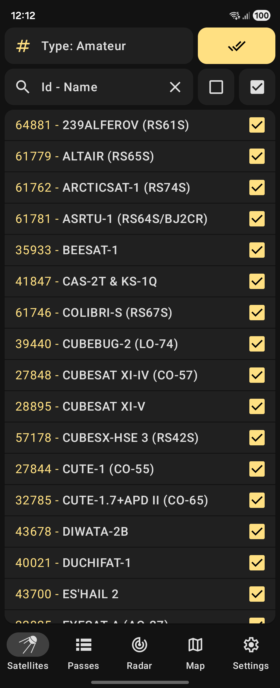
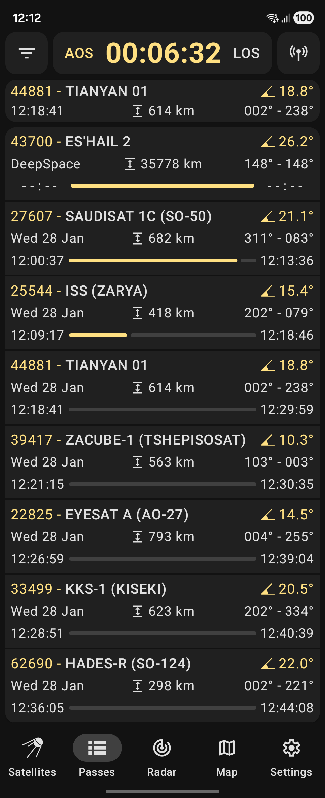
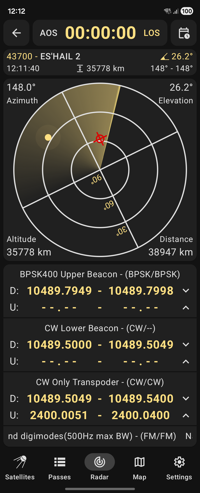
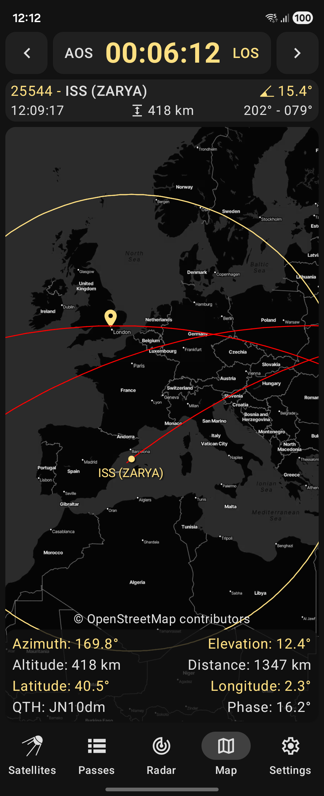

# Look4Sat: Satellite tracker

[](https://github.com/rt-bishop/Look4Sat/actions/workflows/release.yml)

[](https://play.google.com/store/apps/details?id=com.rtbishop.look4sat)
[](https://f-droid.org/packages/com.rtbishop.look4sat/)

### Radio satellite tracker and pass predictor for Android, inspired by Gpredict

<p float="left">




</p>

### Track satellite passes with ease!

Thanks to [Celestrak](https://celestrak.com/) and [SatNOGS](https://satnogs.org/) you have access to over 9000 active satellites.\
You can search the entire database by NORAD Catalog Number or the satellite's name.

Orbital positions and passes are calculated relative to your location.\
To get reliable data make sure to set the station position via the app Settings.

The application is built using Kotlin, Coroutines, Jetpack Compose and Navigation.\
It is now and always will be completely ad-free and open-source.

## Main features:

*  Predicting satellite positions and passes for up to 10 days
*  Showing the list of currently active and upcoming satellite passes
*  Showing the active pass progress, polar trajectory and transceivers info
*  Showing the satellite positional data, footprint and ground track on the map
*  Custom TLE satellite data import is available via Three Line Element .txt files
*  Offline first: calculations are made offline. Weekly TLE data update is recommended.

## 自定义数据源(国内加速)


### 卫星轨道数据

本仓库每 6 小时自动从 [Celestrak](https://celestrak.com/)、[SatNOGS](https://satnogs.org/)、[AMSAT](https://amsat.org/)、[McCants](https://www.mmccants.org/)、[r4uab](https://r4uab.ru/)、[ARIS](https://live.ariss.org/) 获取 TLE 轨道数据并合并为一份文件，地址：

```
https://tledata.xanyi.eu.org/tledata/all.txt
```

在 Look4Sat 中添加此源的步骤：

1. 打开 Look4Sat → 设置 → 卫星数据更新 → 导入文件
2. 在 **卫星数据** Source URL 区域点击 + 添加
3. 粘贴上方地址并保存
4. 点击 **确定** 即可拉取最新数据

> 该数据源合并自 7 个来源，每 6 小时自动更新。

### 转发器/收发机数据

本仓库每 6 小时自动从 [SatNOGS](https://satnogs.org/) 和 [r4uab](https://r4uab.ru/) 获取转发器数据并合并为一份 JSON 文件，地址：

```
https://tledata.xanyi.eu.org/tledata/trans.json
```

在 Look4Sat 中添加此源的步骤：

1. 打开 Look4Sat → 设置 → 卫星数据更新 → 导入文件
2. 在 **收发器数据** Source URL 区域点击 + 添加
3. 粘贴上方地址并保存
4. 点击 **确定** 即可拉取最新数据

> 该数据源合并自 SatNOGS Transmitters API 和 r4uab Transmitters，每 6 小时自动更新。

## Star History

<a href="https://star-history.dera.page/#rt-bishop/Look4Sat&type=timeline&legend=top-left">
 <picture>
   <source media="(prefers-color-scheme: dark)" srcset="https://star-history.dera.page/svg?repos=rt-bishop/Look4Sat&type=timeline&theme=dark&legend=top-left" />
   <source media="(prefers-color-scheme: light)" srcset="https://star-history.dera.page/svg?repos=rt-bishop/Look4Sat&type=timeline&legend=top-left" />
   
 </picture>
</a>
